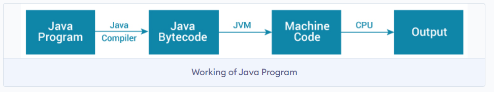
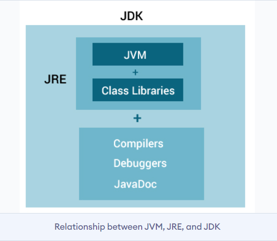

# JVM, JRE, AND JDK 

### JVM (Java Virtual Machine)

**Definition:** JVM stands for Java Virtual Machine. It is an abstract machine that provides a runtime environment in which Java bytecode can be executed.

- **Purpose:** JVM allows Java programs to run on any device or operating system that has a compatible JVM implementation.
- **Execution Process:** When you compile a Java source file (.java) using the Java compiler (`javac`), it generates bytecode (.class files). This bytecode is platform-independent.
- **Platform Independence:** JVM translates the bytecode into native machine code specific to the underlying hardware and operating system. This translation happens at runtime, enabling Java programs to be executed on diverse platforms without modification.

### JRE (Java Runtime Environment)

**Definition:** JRE stands for Java Runtime Environment. It is a package of software that includes:
- JVM (Java Virtual Machine): Executes Java bytecode.
- Java class libraries: Pre-written Java code that provides common functionalities needed by Java programs.

- **Components:**
  - **JVM:** As mentioned, it's responsible for executing Java bytecode.
  - **Java Class Libraries:** These are a collection of classes and packages (like `java.lang`, `java.util`, etc.) that provide core functionalities such as data structures, networking, file I/O, etc.
  
- **Usage:** JRE is required to run Java applications. If you only want to run Java programs and do not need to develop them, installing JRE is sufficient.

### JDK (Java Development Kit)

**Definition:** JDK stands for Java Development Kit. It is a software development kit that includes:
- JRE (Java Runtime Environment): Since JDK includes JRE, it can execute Java programs.
- Development Tools: Tools such as `javac` (Java Compiler), `java` (Java Interpreter), `jar` (Java Archive), `javadoc` (Java Documentation Generator), debugger, profiler, etc.

- **Usage:** JDK is necessary for developing Java applications. It includes everything needed to write, compile, debug, and run Java programs.

### Relationship Between JDK, JRE, and JVM

- **JDK vs. JRE:** JDK is a superset of JRE. It contains all the tools and libraries that a developer needs for writing Java applications. JRE, on the other hand, is the subset that is required for running Java applications.
  
- **JRE vs. JVM:** JRE includes JVM along with necessary libraries. JVM, as explained, is the component responsible for executing Java bytecode.

### Summary

- **JVM:** Executes Java bytecode on different platforms.
- **JRE:** Includes JVM and libraries; needed to run Java applications.
- **JDK:** Includes JRE, development tools, and libraries; needed for developing Java applications.

In essence, JVM ensures that Java's "write once, run anywhere" principle is achieved by providing a consistent runtime environment, while JRE and JDK build upon this foundation to respectively support the runtime and development aspects of Java software.