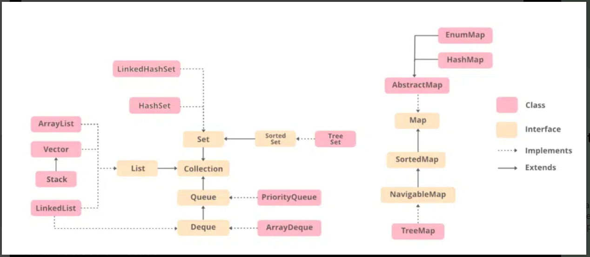

Collections class in Java is one of the utility classes in Java Collections Framework. The java.util package contains the Collections class in Java. Java Collections class is used with the static methods that operate on the collections or return the collection. All the methods of this class throw the NullPointerException if the collection or object passed to the methods is null.

DO IMPS from here: https://www.geeksforgeeks.org/java-collections-interview-questions/



1. **ArrayList**:

   - Implements a dynamic array that can grow as needed.
   - Not synchronized, meaning it's not thread-safe by default.
   - Provides fast iteration and random access.

   ```java
   ArrayList<Type> list = new ArrayList<>();
   ```

2. **Vector**:

   - Similar to ArrayList but synchronized, making it thread-safe.
   - Slower than ArrayList due to synchronization.
   - Allows dynamic growth of the array.

   ```java
   Vector<Type> vector = new Vector<>();
   ```

3. **Stack**:

   - Extends Vector and implements a LIFO (Last-In-First-Out) stack of objects.
   - Deprecated in favor of Deque implementations like ArrayDeque for stack operations.

   ```java
   Stack<Type> stack = new Stack<>();
   ```

4. **LinkedList**:

   - Implements a doubly linked list.
   - Supports insertion and deletion of elements at both ends efficiently.
   - Not synchronized.
     **Iteration:
      Time Complexity: O(n)
      Iterating through a LinkedHashSet is O(n), where n is the number of elements in the set. This is because it involves traversing the linked list of elements.**

```java
LinkedList<Type> linkedList = new LinkedList<>();
```

5. **HashSet**:

   - Implements a hash table to store unique elements.
   - Offers constant-time performance for basic operations like add, remove, contains, and size.
   - Does not maintain insertion order.

   ```java
   HashSet<Type> hashSet = new HashSet<>();
   ```

6. **LinkedHashSet**:

   - Maintains insertion order.
   - Extends HashSet and adds a linked list to maintain order.
   - Slower than HashSet due to maintaining order.

   ```java
   LinkedHashSet<Type> linkedHashSet = new LinkedHashSet<>();
   ```

7. **TreeSet**:

   - Implements a self-balancing binary search tree (Red-Black Tree).
   - Maintains elements in sorted order.
   - Allows for custom sorting via Comparators.

   ```java
   TreeSet<Type> treeSet = new TreeSet<>();
   ```

8. **PriorityQueue**:

   - Implements a priority heap.
   - Elements are ordered based on their natural ordering or by a custom Comparator.
   - Allows for efficient retrieval of the highest-priority element.

   ```java
   PriorityQueue<Type> priorityQueue = new PriorityQueue<>();
   ```

Each of these classes serves different purposes and has different performance characteristics, making them suitable for various scenarios in Java programming. It's important to choose the appropriate class based on your specific requirements, such as thread-safety, ordering guarantees, or performance considerations.

### 1. HashMap

- **Description**: `HashMap` is a part of the Java Collections Framework that stores key-value pairs.
- **Features**:

  - Stores elements as key-value pairs.
  - Allows one `null` key and multiple `null` values.
  - Provides constant-time performance for basic operations (`get` and `put`), assuming a good hash function and load factor.
  - Does not maintain any order of elements.

- **Syntax**:
  ```java
  HashMap<KeyType, ValueType> hashMap = new HashMap<>();
  ```

### 2. TreeMap

- **Description**: `TreeMap` is an implementation of the `SortedMap` interface that uses a Red-Black tree for storage.
- **Features**:

  - Stores elements as key-value pairs.
  - Orders elements based on the natural ordering of its keys or a custom `Comparator` provided at construction time.
  - Provides `O(log n)` time complexity for most operations (get, put, remove).
  - Maintains elements in sorted order.

- **Syntax**:
  ```java
  TreeMap<KeyType, ValueType> treeMap = new TreeMap<>();
  ```

### 3. HashSet

- **Description**: `HashSet` is an implementation of the `Set` interface that uses a hash table for storage.
- **Features**:

  - Stores unique elements.
  - Provides constant-time performance (`O(1)`) for basic operations (`add`, `remove`, `contains`, `size`), assuming a good hash function and load factor.
  - Does not maintain any order of elements.

- **Syntax**:
  ```java
  HashSet<ElementType> hashSet = new HashSet<>();
  ```

### 4. TreeSet

- **Description**: `TreeSet` is an implementation of the `SortedSet` interface that uses a Red-Black tree for storage.
- **Features**:

  - Stores unique elements.
  - Orders elements based on the natural ordering of its elements or a custom `Comparator` provided at construction time.
  - Provides `O(log n)` time complexity for most operations (`add`, `remove`, `contains`).
  - Maintains elements in sorted order.

- **Syntax**:
  ```java
  TreeSet<ElementType> treeSet = new TreeSet<>();
  ```

### 5. LinkedHashSet

- **Description**: `LinkedHashSet` is an implementation of the `Set` interface that maintains insertion order.
- **Features**:

  - Stores unique elements.
  - Maintains insertion order of elements, using a doubly linked list.
  - Provides `O(1)` time complexity for basic operations (`add`, `remove`, `contains`), assuming a good hash function and load factor.

- **Syntax**:
  ```java
  LinkedHashSet<ElementType> linkedHashSet = new LinkedHashSet<>();
  ```

### Summary:

- **HashMap**: Fast for basic operations, no guarantee of order.
- **TreeMap**: Sorted by keys, provides ordered traversal of elements.
- **HashSet**: Fast for basic operations, no guarantee of order, ensures uniqueness.
- **TreeSet**: Sorted by elements, provides ordered traversal of elements, ensures uniqueness.
- **LinkedHashSet**: Maintains insertion order, fast for basic operations, ensures uniqueness.

These classes provide different characteristics and performance trade-offs, allowing developers to choose the appropriate one based on the requirements of their application, such as ordering guarantees, uniqueness of elements, and performance considerations.
