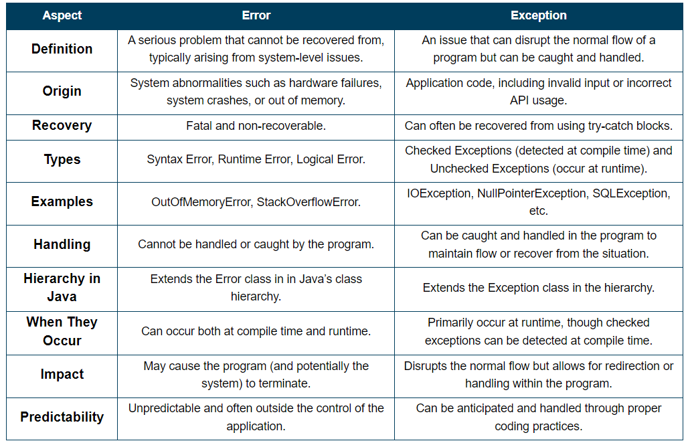

In Java, exceptions are objects that represent exceptional conditions that can occur during the execution of a program. When an exceptional condition arises, an object representing that condition is created and thrown in the method that caused the exception. This disrupts the normal flow of the program and transfers control to an appropriate exception handler.

### Types of Exceptions in Java

Exceptions in Java are broadly categorized into two types:

1. **Checked Exceptions**:

   - These are exceptions that are checked at compile-time by the compiler.
   - The programmer must handle (catch) these exceptions using `try-catch` blocks or declare that they may be thrown using `throws` clause in the method signature.
   - Examples: `IOException`, `SQLException`, `ClassNotFoundException`.

2. **Unchecked Exceptions (Runtime Exceptions)**:
   - These exceptions are not checked at compile-time; hence, they are also known as unchecked exceptions.
   - They occur at runtime and usually indicate programming bugs or errors.
   - Programmers are not required to handle these exceptions explicitly, although they can still be caught using `try-catch` blocks.
   - Examples: `NullPointerException`, `ArrayIndexOutOfBoundsException`, `IllegalArgumentException`.

### Exception Hierarchy in Java

All exceptions in Java are subclasses of the `Throwable` class. The `Throwable` class has two main subclasses:

1. **Exception**:

   - This class represents exceptional conditions that a well-written application should anticipate and recover from.
   - It is further divided into checked exceptions and unchecked exceptions.

2. **Error**:
   - This class represents serious problems that a reasonable application should not try to catch.
   - Errors are typically caused by the environment in which application is running rather than the application itself.
   - Examples: `OutOfMemoryError`, `StackOverflowError`.

### Example Code

Here's an example that demonstrates how checked and unchecked exceptions are used in Java:

```java
import java.io.File;
import java.io.FileReader;
import java.io.FileNotFoundException;
import java.io.IOException;

public class ExceptionExample {

    public static void main(String[] args) {
        checkedExceptionExample();
        uncheckedExceptionExample();
    }

    // Example of a method that throws a checked exception
    public static void checkedExceptionExample() {
        try {
            File file = new File("file.txt");
            FileReader fr = new FileReader(file); // This line may throw FileNotFoundException
            // Read file contents
        } catch (FileNotFoundException e) {
            System.out.println("File not found: " + e.getMessage());
        } catch (IOException e) {
            System.out.println("IOException: " + e.getMessage());
        }
    }

    // Example of a method that throws an unchecked exception
    public static void uncheckedExceptionExample() {
        try {
            int[] arr = new int[5];
            System.out.println(arr[10]); // This line throws ArrayIndexOutOfBoundsException
        } catch (ArrayIndexOutOfBoundsException e) {
            System.out.println("Array index out of bounds: " + e.getMessage());
        }
    }
}
```

In this example:

- `checkedExceptionExample()` method demonstrates handling a checked exception (`FileNotFoundException`) and its superclass (`IOException`).
- `uncheckedExceptionExample()` method demonstrates catching an unchecked exception (`ArrayIndexOutOfBoundsException`).

Understanding and properly handling exceptions is crucial in Java programming to ensure robustness and reliability of the software.


