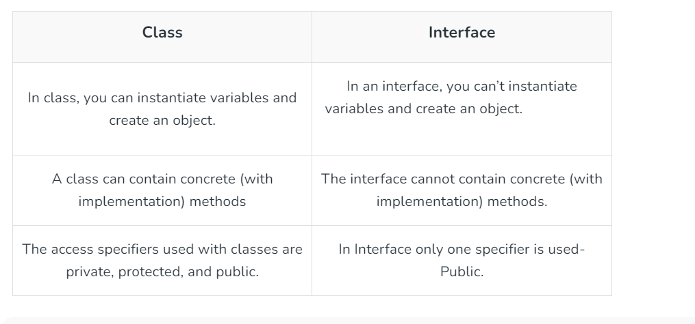

# Interfaces in Java

An Interface in Java programming language is defined as an abstract type used to specify the behavior of a class. An interface in Java is a blueprint of a behavior. A Java interface contains static constants and abstract methods.

What are Interfaces in Java?
The interface in Java is a mechanism to achieve abstraction. There can be only abstract methods in the Java interface, not the method body. It is used to achieve abstraction and multiple inheritances in Java using Interface. In other words, you can say that interfaces can have abstract methods and variables. It cannot have a method body. Java Interface also represents the IS-A relationship

**Uses of Interfaces in Java
Uses of Interfaces in Java are mentioned below:**

1. It is used to achieve total abstraction.
2. Since java does not support multiple inheritances in the case of class, by using an interface it can achieve multiple inheritances.
3. Any class can extend only 1 class, but can any class implement an infinite number of interfaces.
4. It is also used to achieve loose coupling.
   Interfaces are used to implement abstraction.
5. variables in the interface are final, public, and static.

differnce btw class and interface:


Java code example:

```java

// Java program to demonstrate working of
// interface

import java.io.*;

// A simple interface
interface In1 {

    // public, static and final
    final int a = 10;

    // public and abstract
    void display();
}

// A class that implements the interface.
class TestClass implements In1 {

    // Implementing the capabilities of
    // interface.
    public void display(){
      System.out.println("Geek");
    }

    // Driver Code
    public static void main(String[] args)
    {
        TestClass t = new TestClass();
        t.display();
        System.out.println(t.a);
    }
}

// OUTPUT:
// Geek
// 10
```

Implementing multiple inheritance in java by interfaces:

```java
// Java program to demonstrate How Diamond Problem
// Is Handled in case of Default Methods

// Interface 1
interface API {
    // Default method
    default void show()
    {

        // Print statement
        System.out.println("Default API");
    }
}

// Interface 2
// Extending the above interface
interface Interface1 extends API {
    // Abstract method
    void display();
}

// Interface 3
// Extending the above interface
interface Interface2 extends API {
    // Abstract method
    void print();
}

// Main class
// Implementation class code
class TestClass implements Interface1, Interface2 {
    // Overriding the abstract method from Interface1
    public void display()
    {
        System.out.println("Display from Interface1");
    }
    // Overriding the abstract method from Interface2
    public void print()
    {
        System.out.println("Print from Interface2");
    }
    // Main driver method
    public static void main(String args[])
    {
        // Creating object of this class
        // in main() method
        TestClass d = new TestClass();

        // Now calling the methods from both the interfaces
        d.show(); // Default method from API
        d.display(); // Overridden method from Interface1
        d.print(); // Overridden method from Interface2
    }
}


```
