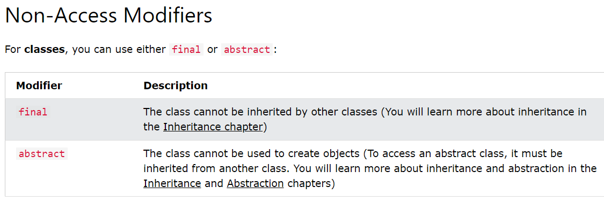
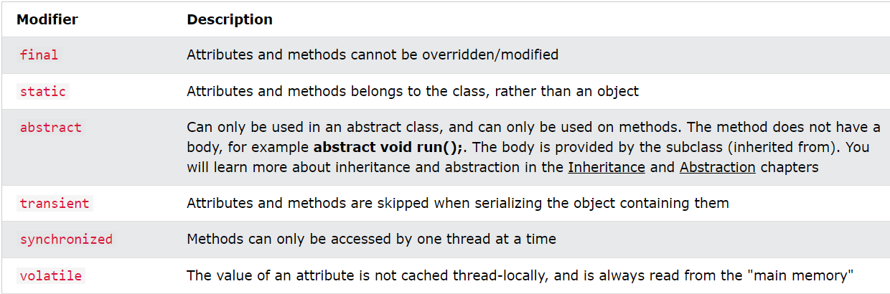

# Final Keyword

Non-Access Modifiers - do not control access level, but provides other functionality

## For Classes



## For Attributes



# IMPORTANT QUESTIONS

1. What is final in Java?

Ans: Final is a keyword that is used to restrict the user in Java programming. It can be applied with variables, methods, or classes. It is a non-access modifier.

2. Why do we need final keyword in Java?
   Or, what is the use of final keyword in Java?

Ans: Final keyword is used in Java program for three different purposes that are as follows:

To declare a constant or to stop the value change. For example, private final int const_value = 50;
To prevent inheritance. When a class is marked with final keyword, it cannot be subclassed. String, Integer, and other wrapper classes are examples of final classes.
To prevent a method from being overridden. When a method is marked with final keyword, it cannot be overridden by subclasses. A method declared with final keyword is faster than any other method because it is resolved at compile time.

3. Why a constructor cannot be final in Java?

Ans: If a method is marked as final it means we do not want any class to override it. As per Java Language Specification, a constructor cannot be overridden. So, there is no use in declaring a constructor as final.

4. What is final variable in Java?

Ans: A variable declared as final is known as a final variable in Java. Once the final variable is initialized, the value of the final variable can never be changed. In other words, we cannot be assigned a new value.

5. When to use final variable in java?

Ans: A final variable can be used when we want to make the value of variable constant throughout the execution of a program.

6. What is the difference between normal variable and final variable?

Ans: The only difference between a normal variable and a final variable is that we can re-assign the value to a normal variable but we cannot re-assign the value of a final variable once assigned it.
[adinserter block=”5″]

7. Will the below code compile fine? If yes, what will be the output?

```java
public class Myclass {
  private final static int x = 10;
   static {
        x++;
    }
public static void main(String[] args) {
  Myclass obj = new Myclass();
    System.out.println(x);
   }
}
```

Ans: No, the above code will not compile successfully because the final field cannot be re-assigned.

8. Is there any error in the below code snippet? If not, what will be the output of the following program?

```java
public class Myclass {
  private final int x = 10;
  void m1()
  {
     final int x = 20;
     System.out.println(x);
   }
public static void main(String[] args) {
  Myclass obj = new Myclass();
      obj.m1();
   }
}
```

Ans: No, there is no error in the above code snippet. Output: 20.

9. What is a blank final variable in Java?

Ans: A variable that is declared as final and not initialized at a time of declaration is called blank final variable.

10. In which line of code snippet, there is an error?

```java
public class Myclass {
  final int x; // line 2
Myclass() {
    x = 10; // line 4
    System.out.println(x++); // line 5
}
public static void main(String[] args) {
    Myclass obj = new Myclass();
   }
}
```

Ans: There is an error in line 5 because the final field cannot be re-assigned.

11. Will the following code compile fine? If yes, what is the output of the following program?

```java
public class Myclass
{
   final int x;
   Myclass()
  {
      x = 10;
     int y = x;
      y++;
      System.out.println(y);
      System.out.println(y++);
   }
public static void main(String[] args) {
    Myclass obj = new Myclass();
  }
}
```

Ans: Yes, the code will compile fine. There is no error in the code snippet. Output: 11, 11.

12. What is the output of the following snippet code?

```java
public class Myclass
{
  final static int x;
  static {
      x = 10;
  }
public static void main(String[] args) {
    System.out.println(x);
   }
}
```

Ans: Output: 10. Note that a blank final variable marked with a static keyword can only be assigned in the static block.

13. Will the following code compile fine?

```java
import java.util.ArrayList;
import java.util.List;
public class Myclass {
public static void main(String[] args)
{
  final List<Integer> obj = new ArrayList<Integer>();
    obj.add(24);
    obj.add(10);
    obj = new ArrayList<Integer>();
    System.out.println(obj);
 }
}
```

Ans: No, there will be a compile-time error because a reference variable declared with final keyword cannot refer to another object.

14. Will the below code snippet compile successfully? If yes, what will be the output of the program?

```java
public class Myclass
{
  final void m1() {
        System.out.println("One");
   }
}
public class Test extends Myclass
{
   void m2() {
       System.out.println("Two");
   }
public static void main(String[] args)
{
   Test t = new Test();
     t.m1();
     t.m2();
   }
}
```

Ans: Yes, the above code will compile successfully because a final method can be inherited in the subclass but we cannot override it.

15. What is the difference between an abstract method and final method in Java?

Ans: The key difference between abstract method and final method is that abstract method must be overridden in the subclass but final method cannot be overridden in the subclass.

16. Is there any error in the following code snippet? If not, what will be the output of the following program?

```java
public class Myclass
{
  final void m1() {
       System.out.println("One");
   }
}
public class Test extends Myclass
{
   void m1(Test t) {
        System.out.println("Two");
   }
public static void main(String[] args)
{
    Test t = new Test();
      t.m1();
       t.m1(null);
   }
}
```

Ans: No, there is no error in the above code snippet. Output: One, Two.

17. What is final class in Java?

Ans: A class declared with a final keyword is called final class. It does not allow itself to be inherited by another class.

18. Which is the most common predefined final class object in Java?

Ans: String

19. What are the two ways to make a class final?

Ans: The first way to make a final class is to declare a class with final keyword. Another way is to declare all of its constructors as private. If a class has only private constructors, it cannot be subclassed.

20. Can we create an instance of final class in another class?

Ans: Yes, we can create an instance of final class in another class but cannot be inherited.

21. Is it possible to change the value of a final variable in Java?

Ans: No, Java does not allow changing the value of a final variable. Once the value is set, it cannot be modified.

22. How can we restrict inheritance in Java?

Ans: If we declare a class final, it cannot be extended. This will restrict the inheritance of that class in Java.

23. Why Integer class has been defined final in Java?

Ans: Integer class is a wrapper for int. If it is not declared final, any other class can extend it and modify the behavior of Integer
operations. To avoid it, Integer wrapper class is declared as final.

24. Can we declare main method as final?

Ans: Yes, we can declare the main method as final.

25. Can we mark a block final in Java?

Ans: No, a block cannot be marked final in java.
