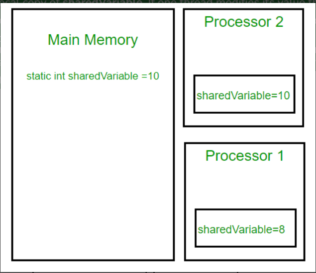
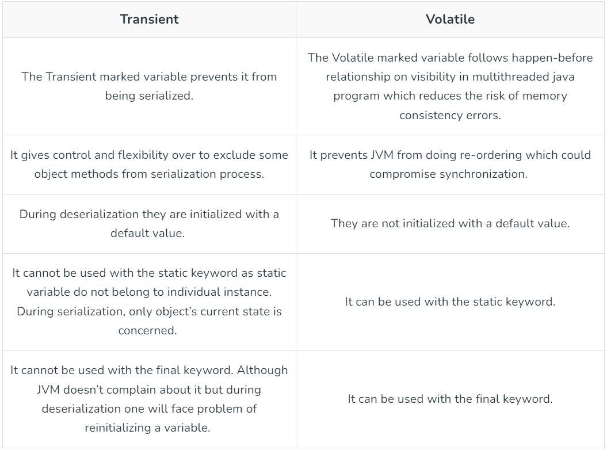

# volatile keyword

In Java, the `volatile` keyword is used to indicate that a variable's value may be modified by multiple threads concurrently. It ensures that when a thread reads the value of a volatile variable, it always gets the most recent write by any other thread, thereby maintaining visibility of changes across threads.

## why exactly we need it?

Suppose that two threads are working on SharedObj. If two threads run on different processors each thread may have its own local copy of sharedVariable. If one thread modifies its value the change might not reflect in the original one in the main memory instantly. This depends on the write policy of cache. Now the other thread is not aware of the modified value which leads to data inconsistency.

The below diagram shows that if two threads are run on different processors, then the value of sharedVariable may be different in different threads.



### Key Points about `volatile`:

1. **Visibility**: Ensures that changes to the variable made by one thread are visible to other threads immediately. Without `volatile`, threads may cache variables locally, leading to inconsistencies if not properly synchronized.

2. **Atomicity**: `volatile` does not provide atomicity (i.e., thread-safe read-modify-write operations). For compound actions, like incrementing a volatile variable, additional synchronization (e.g., using `synchronized` blocks or `java.util.concurrent.atomic` classes) is required.

3. **Use Cases**: Suitable for flags, status flags, or variables accessed frequently by multiple threads where the latest value is crucial, but the operation is simple (like checking a flag).

4. **Performance**: Generally less costly than using locks or synchronization, but does not replace them for more complex operations requiring mutual exclusion.

### Example Usage:

```java
public class SharedResource {
    private volatile boolean flag = false;

    public void setFlagTrue() {
        flag = true;
    }

    public boolean isFlagTrue() {
        return flag;
    }
}
```

In the example above, `flag` is declared as `volatile` to ensure that changes made by one thread using `setFlagTrue()` are immediately visible to other threads calling `isFlagTrue()`, without needing explicit synchronization.

In summary, `volatile` ensures visibility of changes across threads for simple variables but does not replace synchronization mechanisms for complex operations or mutual exclusion.

### transient vs volatile


