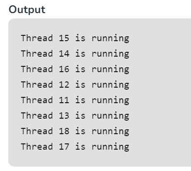

# Multi Threading

Multithreading is a Java feature that allows concurrent execution of two or more parts of a program for maximum utilization of CPU. Each part of such program is called a thread. So, threads are light-weight processes within a process.

Threads can be created by using two mechanisms :

    1. Extending the Thread class
    2. Implementing the Runnable Interface

## Extending the Thread class

Thread creation by extending the Thread class
We create a class that extends the java.lang.Thread class. This class overrides the run() method available in the Thread class. A thread begins its life inside run() method. We create an object of our new class and call start() method to start the execution of a thread. Start() invokes the run() method on the Thread object.

```java
// Java code for thread creation by extending
// the Thread class
class MultithreadingDemo extends Thread {
	public void run()
	{
		try {
			// Displaying the thread that is running
			System.out.println(
				"Thread " + Thread.currentThread().getId()
				+ " is running");
		}
		catch (Exception e) {
			// Throwing an exception
			System.out.println("Exception is caught");
		}
	}
}

// Main Class
public class Multithread {
	public static void main(String[] args)
	{
		int n = 8; // Number of threads
		for (int i = 0; i < n; i++) {
			MultithreadingDemo object
				= new MultithreadingDemo();
			object.start();
		}
	}
}
```



Thread creation by implementing the Runnable Interface
We create a new class which implements java.lang.Runnable interface and override run() method. Then we instantiate a Thread object and call start() method on this object. 


```java
// Java code for thread creation by implementing
// the Runnable Interface
class MultithreadingDemo implements Runnable {
	public void run()
	{
		try {
			// Displaying the thread that is running
			System.out.println(
				"Thread " + Thread.currentThread().getId()
				+ " is running");
		}
		catch (Exception e) {
			// Throwing an exception
			System.out.println("Exception is caught");
		}
	}
}

// Main Class
class Multithread {
	public static void main(String[] args)
	{
		int n = 8; // Number of threads
		for (int i = 0; i < n; i++) {
			Thread object
				= new Thread(new MultithreadingDemo());
			object.start();
		}
	}
}
```


### Thread Class vs Runnable Interface 

1. If we extend the Thread class, our class cannot extend any other class because Java doesn’t support multiple inheritance. But, if we implement the Runnable interface, our class can still extend other base classes.
2. We can achieve basic functionality of a thread by extending Thread class because it provides some inbuilt methods like yield(), interrupt() etc. that are not available in Runnable interface.
Using runnable will give you an object that can be shared amongst multiple threads. 
