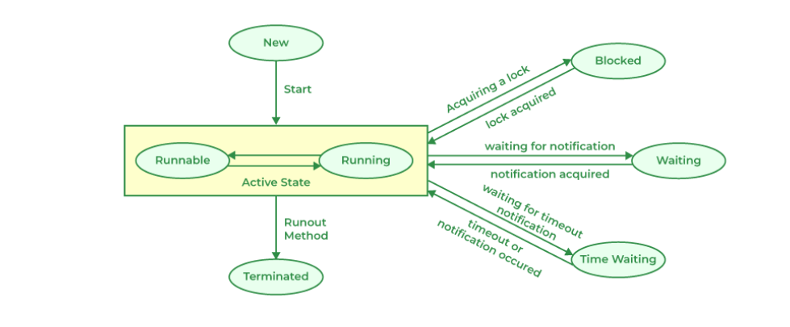

The explanation you provided outlines the various states a thread can exist in during its lifecycle in a multithreaded Java program. Let's summarize and expand upon each state:

### 1. New State

- **Description:** When a thread is created using the `new` keyword but `start()` method is not called yet, it is in the new state.
- **Characteristics:**
  - The thread has been instantiated but its code hasn't started executing yet.
  - The thread object is created, and internal data structures for the thread are allocated.

### 2. Runnable State

- **Description:** When `start()` method is called, the thread transitions to the runnable state.
- **Characteristics:**
  - The thread is ready to run but may or may not be currently executing.
  - It competes with other threads for CPU time managed by the thread scheduler.

### 3. Blocked (or Waiting for a Monitor Lock) State

- **Description:** The thread is in the blocked state when it is waiting to acquire a lock.
- **Causes:**
  - Occurs when a thread attempts to enter a synchronized block or method that is already held by another thread.
  - The thread will remain in this state until the lock becomes available, at which point it moves to the runnable state.

### 4. Waiting State

- **Description:** Threads enter the waiting state by calling `Object.wait()`, `Thread.join()`, or similar methods.
- **Characteristics:**
  - They remain in this state until another thread invokes `notify()`, `notifyAll()`, or the timeout period (if specified) expires.
  - Once notified or the waiting condition changes, the thread moves to the runnable state.

### 5. Timed Waiting State

- **Description:** Threads enter the timed waiting state by calling methods like `Thread.sleep()`, `Object.wait(timeout)`, or `Thread.join(timeout)`.
- **Characteristics:**
  - Similar to the waiting state but with a specified timeout period.
  - Threads remain in this state until the timeout expires or until they are notified.
  - Upon timeout expiration or notification, they move to the runnable state.

### 6. Terminated (or Dead) State

- **Description:** Threads enter the terminated state when their `run()` method completes execution.
- **Causes:**
  - Normal termination occurs when the `run()` method exits naturally without exceptions.
  - Abnormal termination occurs due to unhandled exceptions or errors (e.g., `OutOfMemoryError`).
  - Once terminated, a thread cannot be restarted.

### Summary

Understanding these states is crucial for managing threads effectively in Java, especially when dealing with shared resources and synchronization. Properly handling thread states ensures correct program behavior and prevents issues such as deadlocks and race conditions. Each state represents a phase in a thread's lifecycle, from creation to termination, and developers must consider these states when designing and debugging multithreaded applications.
